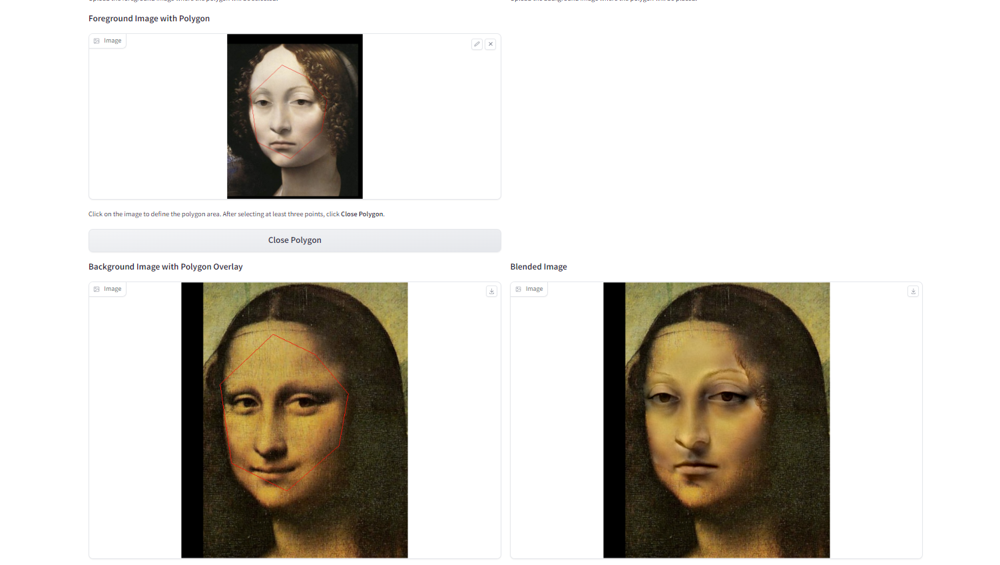
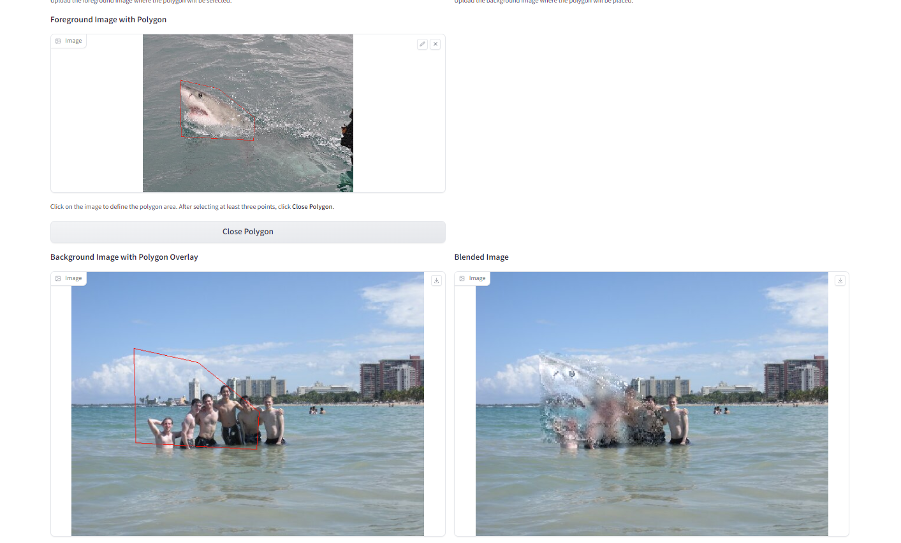
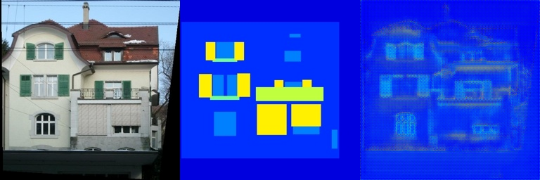
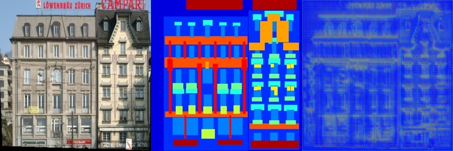
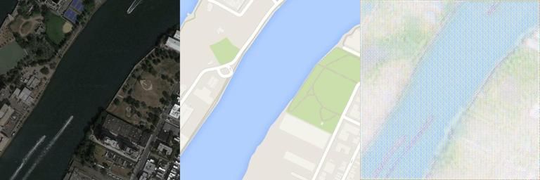
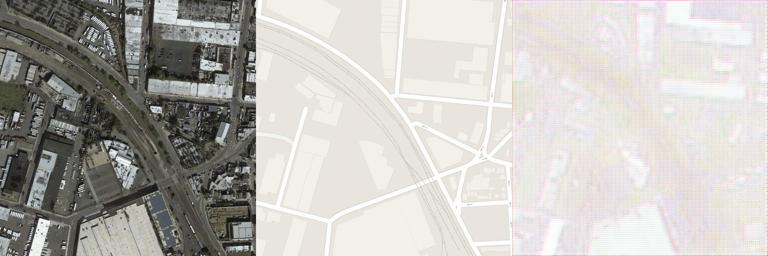

# 作业报告

## 1. Poisson Image Editing

在本节中，我们进行了 Poisson 图像编辑，以下是通过该方法获得的结果图。

### 结果图 1: 蒙娜丽莎换脸记
  

### 结果图 2: 幽灵鲨撕咬人群
 

---

## 2. FCNNetwork

在这一部分，我们使用了全卷积网络进行图像处理，以下是我们获得的结果。

### 第一次实验
- **设置**: 4 层网络,最大channel数32
- **训练结果**: 在约 300 次迭代时，损失值（loss）在 0.37 左右震荡，不再下降。但结果却非常差。

#### 结果图 1
  
#### 结果图 2
  

### 第二次实验
- **设置**: 5 层网络，最大channel数64
- **训练结果**: 在约 100 次迭代时，损失值（loss）在 0.33 左右震荡，不再下降。但结果却还是非常差。

后面又头铁各种改网络尝试，但结果还是一团糟，觉得可能是数据集本身有点问题，换个数据集试一下。
换成了maps数据集。
一换效果好多了.
原本facades那边300层都突破不了0.3的loss，这边maps训10层loss只剩0.1了。
- **设置**: 5 层网络，最大channel数64
- **训练结果**: 在约 30 次迭代时，损失值（loss）在 0.08 左右震荡，不再下降。
#### 结果图 3
  
#### 结果图 4
 
但是有点太白了，效果还是没有特别理想。

