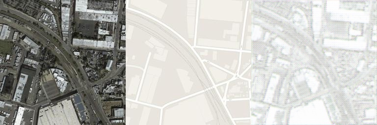
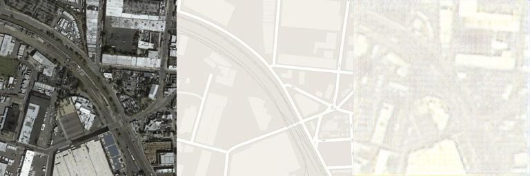
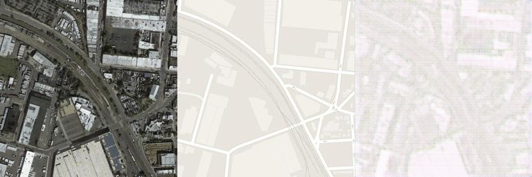
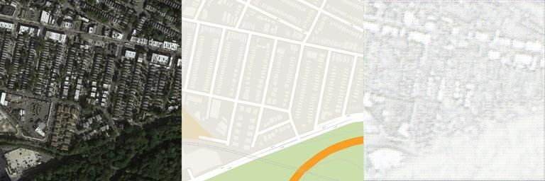
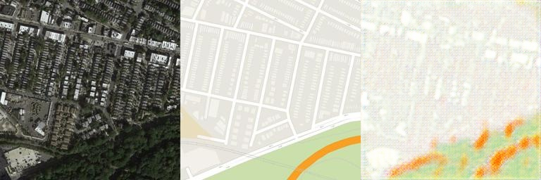
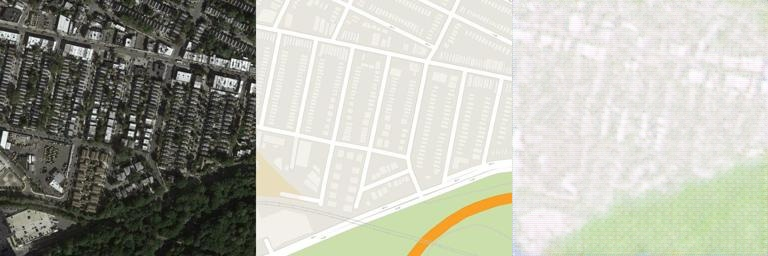

# Part 1

使用对抗神经网络生成图片。
使用数据库：maps。
以下是不同最大通道数生成的图片。

*最大通道数：64

*最大通道数：256

*最大通道数：1024

*最大通道数：64

*最大通道数：256

*最大通道数：1024

尝试了很多次不同网络结构和其他一些参数，但是生成的图片依然与真实图片有一点差距，最大的区别是路没有生成出来，后来猜测原因可能是数据集本身的限制（路与空地太过相似难以区分）。/n
结果来看最大通道数256层的效果与1024层的区别不大，比64层的略好些。/n
实验过程中平衡判别器和生成器的强度花了较长时间，因为上网搜得知在模型训练过程中g loss和d loss的数值相近且稳步下降时效果最好，于是多次调整参数，包括降低判别器的训练频率和学习率。
