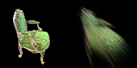
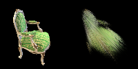
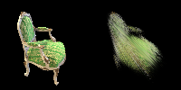
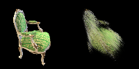
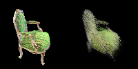

# 第四次作业

代码填充部分见上传的两个python文件。

实验设置：由于默认设置我电脑gpu不够跑，所以想了一些办法降低点云的密度。
1.删除chair里的一些相似图片，从100张删到60张左右。
2.设置colmap里的采样特征数，默认值为2000，设为1100.

训练最大层数：设置为100epoch.
以下是不同epoch生成的图片。

*epoch：0

*epoch：5

*epoch：10

*epoch：20

*epoch：30

*epoch：40

*epoch：50

